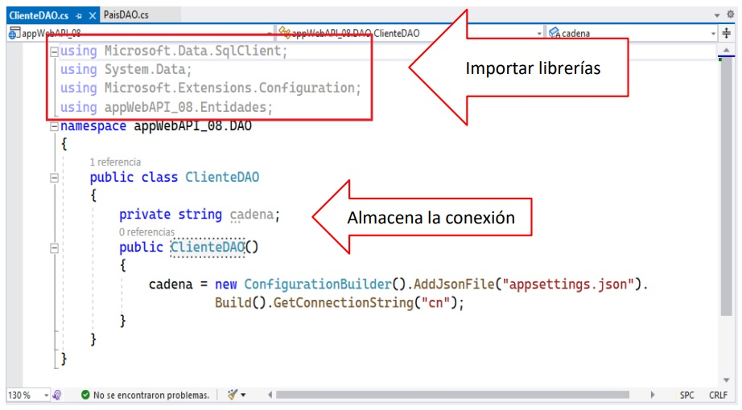

# LABORATORIO-5.1

### Implementando un CRUD en un Servicio Web API

Implemente un proyecto ASP.NET Core MVC que permita consumir un servicio Web Api para realizar el mantenimiento a la tabla tb_clientes de la base de datos Negocios2022.

# 1. Trabajando con el Manejado del SQL Server

En el Manejado activamos la base de datos Negocios2022 y creamos los procedures de listado para tb_clientes y tb_países.

A continuación, definimos los procedures para insertar y actualizar un registro de tb_clientes, tal como se muestra.

# 2. Trabajando con el proyecto Web API

Abrimos el Visual Studio, seleccionamos Aplicación web ASP.NET Core Web API, tal como se muestra.

En la ventana Configure su nuevo proyecto, asigne el nombre, dirección y nombre de la solución, tal como se muestra.

## Creando carpetas

Para comenzar, creamos dos carpetas en el proyecto: Entidades y DAO, tal como se muestra

En la carpeta Entidades, agregar dos clases: Cliente.cs y País.cs; agregar los atributos a cada una de las Clases.

Colocar los atributos en cada clase

## Definiendo la cadena de conexión

En el archivo appsettings.json, defina la cadena de la conexión a la base de datos, tal como se muestra.

En la carpeta DAO, agregar las clases PaísDAO y ClienteDAO, tal como se muestra

## Trabajando con la clase PaísDAO

En la clase importar las librerías de trabajo y la carpeta Entidades. En el cuerpo de la clase, defina una variable cadena la cual almacena el contenido de la conexión almacenada en appsettings.json, tal como se muestra.

A continuación, defina el método GetPaíses(), el cual ejecuta el procedure y retorna los registros de tb_países.

## Trabajando con la clase ClienteDAO

En la clase importar las librerías de trabajo y la carpeta Entidades. En el cuerpo de la clase, defina una variable cadena la cual almacena el contenido de la conexión almacenada en appsettings.json, tal como se muestra.

A continuación, defina el método GetClientes(), el cual ejecuta el procedure y retorna los registros de tb_clientes.

Defina el método Agregar, el cual ejecuta el procedimiento almacenado para insertar un cliente, retornando el mensaje de la operación.

Defina el método Actualizar, el cual ejecuta el procedimiento almacenado para actualizar un cliente, retornando el mensaje de la operación.

## Trabajando con el Controlador

En la carpeta Controllers, agregue un controlador en blanco de tipo API, tal como se muestra. Asigne el nombre del controlador: NegociosAPIController.

En el controlador, primero importamos las carpetas DAO, Entidades, tal como se muestra.

A continuación, defina los métodos Get(), el cual ejecuta el método GetClientes y el método GetPaís(), el cual ejecuta y retorna los registros de tb_países, tal como se muestra.

A continuación, defina los métodos InsertaCliente(), el cual ejecuta el método Agregar y el método ActualizaCliente(), el cual ejecuta el método para actualizar un cliente, tal como se muestra.

Al ejecutar el proyecto, cuyo puerto es 7272, visualizamos la lista de métodos y sus direcciones a las cuales podemos acceder.

